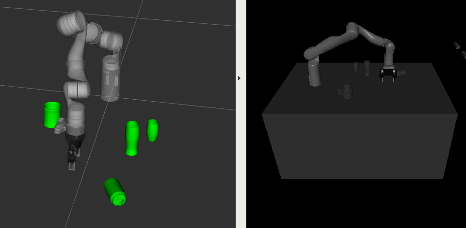

#Kinova MuJoCo simulation with scene of objects



Start simulation by 

```shell script
roslaunch kinova_mujoco table_simulation_generated.launch
```

##Scene preparation for MuJoCo

MuJoCo requires the whole scene to be described by a single model.
We generate URDFs from the robot workspace plus objects. To 
make the simulation more stable, we decompose the object meshes
into mant small convex bodies. 